# Station Météo Connectée BLE

**Projet BLE & Capteurs - Université de Poitiers**

Station météorologique connectée basée sur STM32 avec transmission de données environnementales via Bluetooth Low Energy et port série.

## Description

Ce projet implémente un système complet de mesure environnementale comprenant :
- Acquisition de données via capteurs (température, humidité, pression)
- Microcontrôleur STM32L476RG pour le traitement
- Double communication : filaire (USB-Série) et sans fil (BLE)
- Interface graphique Qt pour la visualisation en temps réel

## Architecture du Système

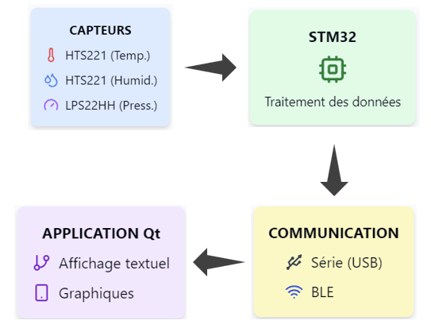

*Flux de données : des capteurs vers l'application de visualisation*

## Matériel Utilisé

- **STM32L476RG Nucleo** - Microcontrôleur principal
- **X-NUCLEO-IKS01A3** - Shield capteurs environnementaux
  - HTS221 : Capteur température/humidité
  - LPS22HH : Capteur de pression (260-1260 hPa)
- **X-NUCLEO-BNRG2A1** - Module Bluetooth Low Energy

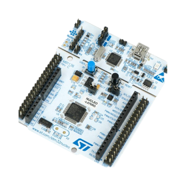 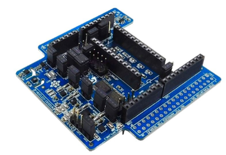 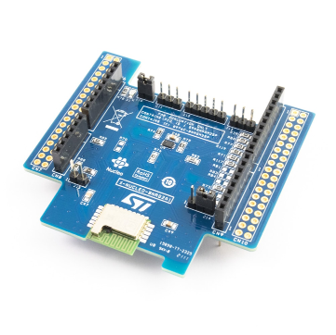

*Les trois cartes principales du projet*

## Prérequis

### Partie Embarquée
- STM32CubeIDE
- STM32CubeMX
- Driver ST-LINK

### Partie Application
- Qt 6.8.3 ou supérieur
- CMake 3.16+
- Compilateur C++17
- Modules Qt requis :
  - Qt Core
  - Qt Widgets
  - Qt Bluetooth
  - Qt SerialPort

## Installation

### 1. Configuration STM32

```bash
# Cloner le repository
git clone <repository-url>
cd BLEProject

# Ouvrir le projet STM32 dans STM32CubeIDE
# Compiler et flasher sur la carte
```

#### Montage Physique

En raison d'incompatibilités entre les shields, un montage spécifique avec des fils de connexion est nécessaire :

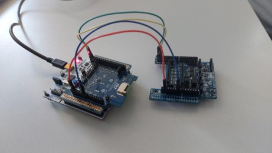

*Station météo assemblée avec les trois cartes*

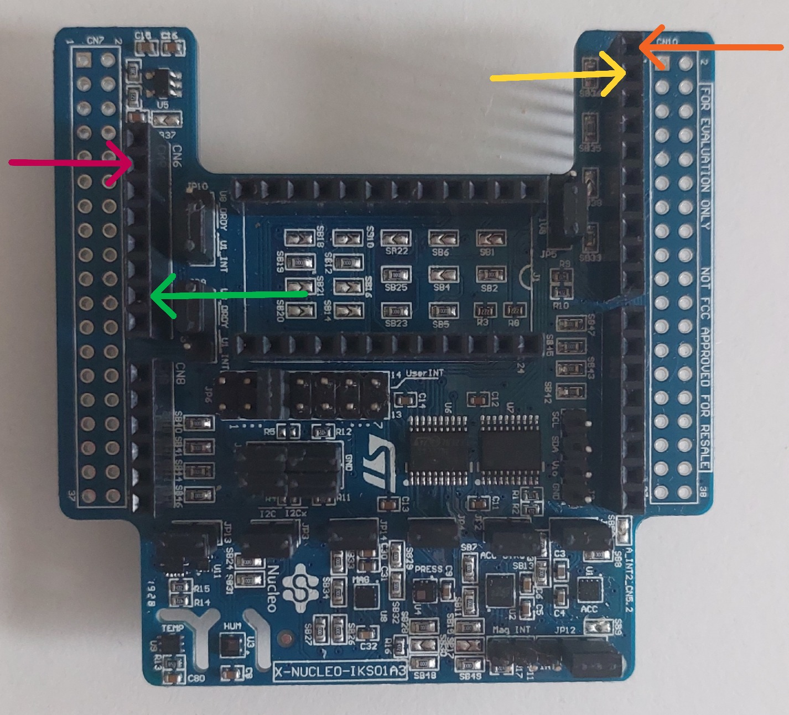

*Détail des connexions entre les cartes*

### 2. Compilation Application Qt

```bash
# Créer un dossier de build
mkdir build
cd build

# Configurer avec CMake
cmake ..

# Compiler
make
# ou sur Windows
cmake --build .
```

## Utilisation

### 1. Lancement de la Station

1. Connecter les cartes selon le schéma de montage
2. Alimenter le système via USB
3. La LED de la carte Nucleo clignote pour indiquer le fonctionnement

### 2. Application Qt

1. Lancer l'application
2. Choisir le mode de connexion :
   - **Port Série** : Sélectionner le port COM approprié
   - **Bluetooth** : Scanner et sélectionner le périphérique BLE
3. Visualiser les données en temps réel dans les onglets :
   - **Données textuelles** : Valeurs instantanées
   - **Graphiques** : Evolution temporelle
   - **Configuration** : Paramètres de connexion

#### Interface Utilisateur

**Données textuelles :**
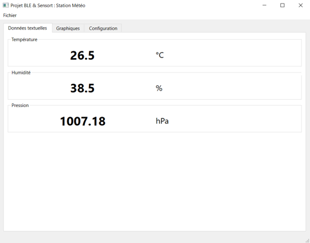

**Graphiques temps réel :**
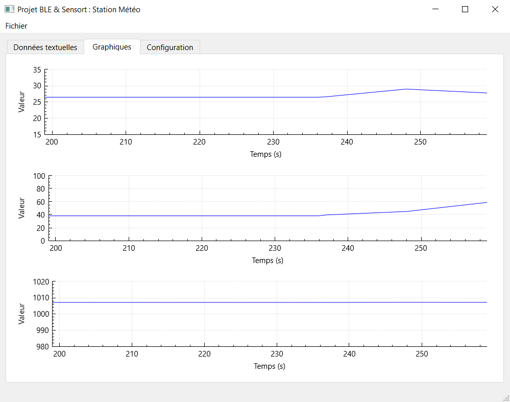

**Configuration des connexions :**

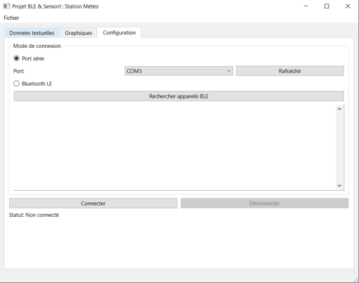 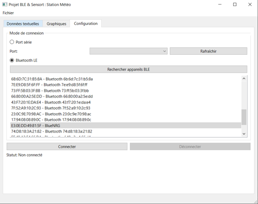

### 3. Format des Données

**Communication Série :**
```
P: 1007.18 hPa, T: 26.5 C, H: 38.5 %
```

**Communication BLE :**
```
Timestamp (2 octets) | Pression (4 octets) | Température (2 octets) | Humidité (2 octets)
```

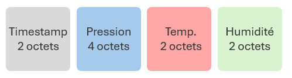

*Structure des données transmises via Bluetooth Low Energy*

## Structure du Projet

```
.
├── BLEProject/                 # Projet STM32
│   ├── Core/
│   │   ├── Inc/
│   │   └── Src/
│   ├── Drivers/
│   └── Middlewares/
├── SensorDemo_BLE_I476rg/      # Application Qt
│   ├── src/
│   ├── inc/
│   ├── CMakeLists.txt
│   └── mainwindow.ui
├── images/                     # Images pour documentation
│   ├── montage.jpg
│   ├── qt_donnees_textuelles.png
│   ├── qt_graphique.png
│   └── ...
├── README.md
└── .gitignore
```

## Fonctionnalités

### Partie STM32
- Lecture périodique des capteurs (10 secondes)
- Transmission des données via UART et BLE
- Gestion des interruptions
- Configuration GATT pour BLE

### Application Qt
- Interface utilisateur intuitive avec onglets
- Graphiques temps réel avec QCustomPlot
- Support double communication
- Détection automatique des ports série
- Scan des périphériques BLE

## Test et Validation

Le système a été testé avec :
- **ST BLE Sensor** (application mobile officielle STMicroelectronics)
- Communication série via terminal
- Interface Qt développée

### Application ST BLE Sensor

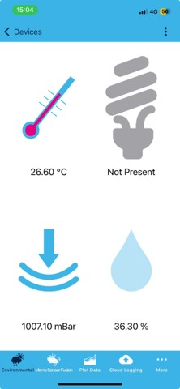

*L'application officielle ST reconnait automatiquement notre station et affiche les données environnementales*

## Dépannage

### Problèmes courants

**Carte non détectée :**
- Vérifier les pilotes ST-LINK
- Contrôler les connexions USB

**Communication BLE impossible :**
- Vérifier le support Bluetooth de l'ordinateur
- S'assurer que Qt Bluetooth est installé

**Compilation Qt échoue :**
- Vérifier la version de Qt (6.8.3+)
- Installer les modules manquants

## Technologies

 

- **Langage** : C (STM32), C++ (Qt)
- **Framework** : Qt 6.8.3
- **Build System** : CMake
- **Communication** : Bluetooth Low Energy, UART
- **Graphiques** : QCustomPlot

## Améliorations Futures

- Exportation des données (CSV, JSON)
- Système d'alertes configurables
- Configuration à distance
- Ajout de nouveaux capteurs (accéléromètre, magnétomètre)
- Interface web

## Auteurs

- **Victor FRICONNET** - Développement STM32 et Qt
- **Ronan PLUTA** - Développement STM32 et Qt

**Institution :** Université de Poitiers - Faculté des Sciences Fondamentales et Appliquées

## Licence

Projet académique - Université de Poitiers (2025)